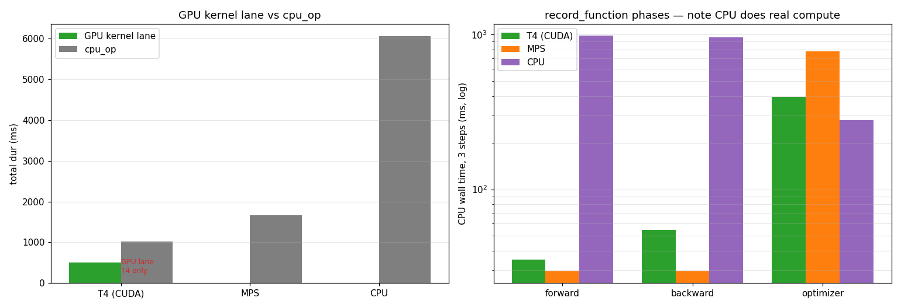

# 프로파일 비교 레포트 — T4(CUDA) vs MPS vs CPU

> 같은 워크로드(DistilBERT binary 학습 1 step, bs=16/seq=128, `record_function` forward/backward/optimizer, active 3 step)를 **세 인프라**에서 프로파일한 chrome trace 를 파싱·비교합니다.
>
> - `trace_train.json` — Google Colab **T4 (CUDA)**, 실제 yelp 데이터
> - `trace_mps.json` — 로컬 **Apple Silicon (MPS)**, 실제 yelp 데이터
> - `trace_cpu.json` — 로컬 **CPU only** (M1, 8 threads), 더미 입력(동일 shape — op 시간은 데이터값 무관)

---

## 1. 가장 큰 차이 — GPU 커널 레인의 유무

| 카테고리 | T4 (CUDA) | MPS | CPU |
|---|---:|---:|---:|
| `kernel` (GPU 커널) | **500 ms** | — | — |
| `cuda_runtime` | 428 ms | — | — |
| `gpu_memcpy/memset` | 1.4 ms | — | — |

`volta_sgemm_*`·`fmha_*` 같은 GPU 커널은 **T4 에서만** 잡힙니다. MPS·CPU trace 에는 GPU 레인이 없습니다 — 단 이유가 다릅니다(아래).

## 2. forward / backward / optimizer — 시간이 "어디에" 잡히나

`record_function` 구간 CPU wall (active 3 step 합):

| 구간 | T4 (CUDA) | MPS | CPU |
|---|---:|---:|---:|
| forward | 35 ms | 30 ms | **980 ms** |
| backward | 55 ms | 30 ms | **958 ms** |
| optimizer | 396 ms | 778 ms | 279 ms |

- **T4 / MPS**: forward·backward 의 CPU wall 이 작습니다(30-55 ms). 실제 계산은 가속기(GPU)가 하고 CPU 는 *던지기(launch/dispatch)* 만 합니다. T4 는 그 GPU 시간이 `kernel`(500 ms)로 따로 보이고, MPS 는 GPU 시간이 trace 에 안 잡혀 *가려져* 있습니다.
- **CPU**: forward 980 ms·backward 958 ms — **CPU 가 실제로 matmul 을 돌려서** 압도적으로 무겁습니다. "가속기가 없으니 CPU wall = 실제 연산시간".

## 3. 1위 op 의 정체 — 가속기 vs CPU 의 정반대 시그니처

| 인프라 | top cpu_op | 의미 |
|---|---|---|
| T4 | `aten::item` 382 ms | **GPU→CPU 동기화** (가속기가 멈춤) |
| MPS | `aten::item` 736 ms | 동기화, T4 의 ~2배 (dispatch 무거움) |
| CPU | `AddmmBackward`/`aten::mm` 559-596 ms, `scaled_dot_product_attention` 394 ms | **실제 행렬 연산** |

→ **가속기(T4/MPS)는 `aten::item`(동기화)이 1위**, **CPU 는 `aten::mm`(실제 compute)이 1위**. CPU 에는 `aten::item` 이 top 에 없습니다 — CPU-CPU 라 동기화가 사실상 공짜.

## 4. 시그니처로 환경 역추적

trace 만 보고 어느 인프라인지 맞히기:

| 단서 | 결론 |
|---|---|
| `volta_sgemm`·`cuda_runtime`·`gpu_memcpy` 존재 | **T4 (CUDA)** |
| GPU 레인 없음 + `aten::item` 1위 + `*_for_mps` op | **MPS** (가속기인데 GPU 시간 미수집) |
| GPU 레인 없음 + `aten::mm`/`AddmmBackward` 1위 + `aten::item` 없음 | **CPU only** (순수 연산) |

## 5. 종합

| 항목 | T4 (CUDA) | MPS | CPU |
|---|---|---|---|
| GPU 커널 레인 | ✅ 500 ms | ❌ (가려짐) | ❌ (없음) |
| forward/backward 실측 | GPU 가 빠르게 | 미수집 | CPU 가 느리게 (980/958) |
| 1위 비용 | 동기화(item) | 동기화(item) ~2배 | 실제 matmul |
| 주 병목 | sync + optimizer | sync + dispatch | **compute (forward/backward)** |
| 같은 3 step 성격 | 가속, sync 가 발목 | 가속이나 trace 가림 | compute-bound, 가장 느림 |

### 시사점

1. **CPU 는 forward/backward(matmul) 자체가 병목** — 가속기가 없으니 당연. 큰 모델·batch 면 비현실적으로 느려짐 → GPU 가 필요한 이유가 trace 로 드러남.
2. **가속기(T4/MPS)에선 동기화(`aten::item`)가 발목** — 학습 루프의 불필요한 `.item()`/`.cpu()` 를 줄이면 가속기가 덜 멈춥니다.
3. **MPS 는 "가속은 되는데 GPU 시간이 안 보이는" 어정쩡한 위치** — 코드는 돌고 빠르지만(CPU 대비) 커널 레벨 분석은 불가. 커널 튜닝은 CUDA 에서.
4. **trace 시그니처로 환경을 역추적**할 수 있습니다(§4) — 프로파일 읽기의 핵심 훈련.

---

*세 chrome trace 를 PyTorch Profiler 스키마로 파싱해 집계. CPU 는 동일 shape 더미 입력(op 시간은 데이터값 무관). 수치는 active 3 step 합계.*
