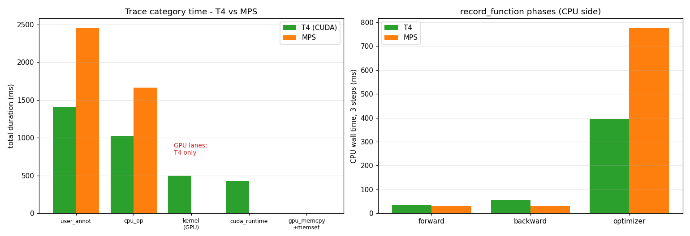

# 프로파일 비교 레포트 — Google Colab T4 (CUDA) vs Apple Silicon MPS

> 같은 노트북(`10_bert_binary_sigmoid/appendix_profiling.ipynb`)의 **학습 프로파일 §4**(DistilBERT binary, `schedule(wait=1, warmup=1, active=3)`) 를 두 인프라에서 뽑은 chrome trace 를 비교합니다.
>
> - `trace_train.json` — Google Colab **T4 (CUDA)**
> - `trace_mps.json` — 로컬 **Apple Silicon (MPS)**
> - 동일한 워크로드·동일한 active 3 step 이라 비교가 공정합니다.



---

## 1. 한눈에 — trace 카테고리별 시간

| 카테고리 | 의미 | T4 (CUDA) | MPS |
|---|---|---:|---:|
| `user_annotation` | record_function 구간 (CPU wall) | 1,407 ms | 2,459 ms |
| `cpu_op` | CPU 측 aten op | 1,026 ms | 1,664 ms |
| **`kernel`** | **GPU 커널 (실제 연산)** | **500 ms** | **— (없음)** |
| `cuda_runtime` | CUDA launch/API | 428 ms | — |
| `gpu_user_annotation` | GPU 측 구간 | 216 ms | — |
| `gpu_memcpy + memset` | GPU 메모리 이동 | 1.4 ms | — |

**가장 큰 차이는 "GPU 레인의 유무"** 입니다. T4 trace 에는 `kernel`·`cuda_runtime`·`gpu_memcpy`·`gpu_user_annotation` 이 또렷이 잡히는데, MPS trace 에는 **CPU 측(`cpu_op`, `user_annotation`)만** 존재합니다.

---

## 2. 핵심 차이 ① — GPU 커널이 보이는가

**T4**: PyTorch Profiler 가 CUDA 커널을 device 레인에 직접 기록합니다. 그래서 "GPU 가 실제로 무슨 연산을 했는가"를 ms 단위로 봅니다.

```
T4 top GPU kernels (cat=kernel, 합 500 ms)
   79.1 ms  x90   volta_sgemm_128x64_nn      ← matmul (linear/attention)
   77.8 ms  x90   volta_sgemm_128x64_nt
   73.6 ms  x90   volta_sgemm_128x64_tn
   38.7 ms  x18   volta_sgemm_128x128_nn
   33.9 ms  x18   fmha_cutlassB_..._sm75     ← fused attention
   17.1 ms  x16   multi_tensor_apply (AdamW foreach)
```

**MPS**: `torch.profiler` 가 **MPS 커널 시간을 아직 device 레인으로 수집하지 못합니다.** GPU 연산은 일어나지만 trace 에는 안 잡히고, 대신 그 호출이 **CPU op 시간에 흡수**됩니다. (MPS 전용 op 이름 `aten::_scaled_dot_product_attention_math_for_mps` 는 CPU 측에서 보이지만, GPU 실행 시간 자체는 빠져 있음)

> **시그니처로 환경 역추적**: `volta_sgemm*` / `cuda_runtime` / `gpu_memcpy` 가 보이면 **CUDA(T4)**. 이것들이 전부 없고 `*_for_mps` op 만 CPU 레인에 있으면 **MPS**.

---

## 3. 핵심 차이 ② — 시간이 "어디에" 기록되나

`record_function` 구간(forward/backward/optimizer)의 CPU wall time (active 3 step 합):

| 구간 | T4 (CPU wall) | T4 (GPU 측) | MPS (CPU wall) |
|---|---:|---:|---:|
| forward | 35.2 ms | 133.4 ms | 29.5 ms |
| backward | 54.9 ms | ~0* | 29.6 ms |
| optimizer | 395.9 ms | — | 777.8 ms |

\* T4 의 backward GPU 시간은 커널 레인에는 잡히지만 gpu_user_annotation 으로는 거의 0 으로 분류됨 (구간 라벨 전파 한계).

해석:
- **T4** 는 CPU wall(forward 35 ms)이 작아도 **GPU 에서 133 ms** 동안 matmul 이 돕니다 — CPU 는 커널을 *던지고(launch)* GPU 가 실제 계산. CPU/GPU 가 분리돼 보입니다.
- **MPS** 는 forward/backward 가 29 ms 로 비슷하게 작게 찍히는데, 이는 GPU 실행 시간이 분리되지 않아 **CPU 측 dispatch 시간만** 본 것에 가깝습니다. "진짜 GPU 가 얼마 걸렸나"는 이 trace 로 알기 어렵습니다.

---

## 4. 공통 병목 — `aten::item`(동기화)과 optimizer

두 인프라 모두 **CPU op 1위가 `aten::item` / `aten::_local_scalar_dense`** 입니다:

| op | T4 | MPS |
|---|---:|---:|
| `aten::item` | 382 ms (x627) | 736 ms (x318) |
| `aten::_local_scalar_dense` | 381 ms | 735 ms |

`aten::item` 은 **GPU→CPU 동기화를 강제하는 호출**입니다. 텐서 한 값을 CPU 로 끌어오느라 가속기가 멈춥니다. 두 환경 모두에서 이게 가장 큰 단일 비용이고, **MPS 에서 약 2배 비쌉니다**(동기화·dispatch 가 CUDA 보다 무거움).

또 `optimizer` 구간이 forward/backward 보다 훨씬 큰데(T4 396 ms, MPS 778 ms), 작은 batch(16)에서 AdamW 의 per-parameter 처리 overhead 가 compute 보다 지배적이기 때문입니다. 이건 **batch 가 작을 때 흔한 패턴**이고, batch 를 키우면 forward/backward(GPU compute) 비중이 커지면서 상대적으로 작아집니다.

---

## 5. 속도 — 같은 active 3 step

record_function 구간 합:
- **T4**: 35 + 55 + 396 = **486 ms** (그중 GPU matmul 500 ms 가 겹쳐 돎)
- **MPS**: 30 + 30 + 778 = **837 ms**

→ 같은 작업에 **MPS 가 약 1.7배 느립니다**. 단 이 구간은 동기화·optimizer overhead 가 지배하는 작은-batch 구간이라, 순수 GPU matmul 성능 차(volta_sgemm vs MPS)는 더 클 수 있습니다(MPS 는 GPU 시간이 trace 에 안 잡혀 직접 비교 불가).

---

## 6. 종합 — 인프라별 프로파일 시그니처

| 항목 | T4 (CUDA) | MPS (Apple Silicon) |
|---|---|---|
| GPU 커널 레인 | ✅ `kernel`(volta_sgemm, fmha) | ❌ 없음 (CPU 에 흡수) |
| CUDA runtime/memcpy | ✅ | ❌ |
| GPU 실제 연산 시간 측정 | 가능 (500 ms) | **불가** (trace 미수집) |
| CPU↔GPU 분리 | 또렷 | 불분명 |
| 대표 op 이름 | `volta_sgemm_*`, `fmha_cutlassB_*` | `*_for_mps` (CPU 레인) |
| 공통 병목 | `aten::item`(동기화), optimizer | 동일하나 ~2배 비쌈 |
| 같은 3 step | 486 ms | 837 ms (~1.7x) |

### 시사점

1. **GPU 커널 레벨 분석·정밀 VRAM 은 CUDA 에서.** MPS 는 코드가 돌고 정확도·시간 *비교* 는 되지만, "어떤 GPU 커널이 비싼가"는 안 보입니다 → 커널 튜닝은 T4/Colab 에서.
2. **동기화(`aten::item`)는 어느 환경에서도 비쌈.** 학습 루프에서 불필요한 `.item()`/`.cpu()` 를 줄이면 양쪽 다 빨라집니다 (특히 MPS).
3. **작은 batch 에선 optimizer·dispatch overhead 가 지배.** batch 를 키우면 GPU compute(matmul) 비중이 커집니다 — 모델 크기 스케일링 실험과 연결됩니다.
4. **trace 만 보고 환경을 역추적**할 수 있습니다: `volta_sgemm`+`cuda_runtime` → T4, `*_for_mps`+GPU레인 없음 → MPS.

---

*생성: 두 chrome trace(`trace_train.json` T4, `trace_mps.json` MPS) 를 PyTorch Profiler 스키마로 파싱해 집계. 수치는 active 3 step 합계 기준.*
