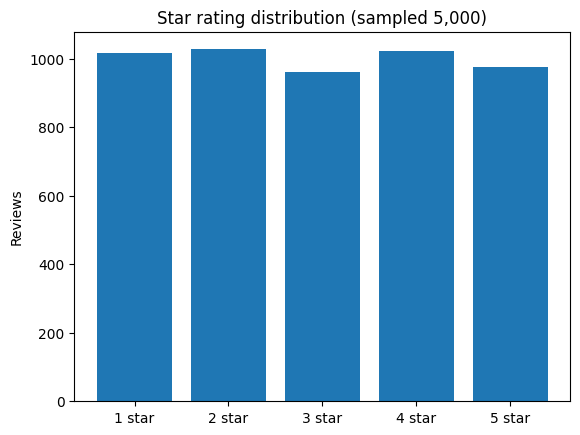

## 환경 준비

```python
!pip install -q datasets scikit-learn pandas matplotlib
```

<!-- 실행 결과 없음: --execute 또는 --executed-notebook 로 결과를 채우세요 -->

```python
import numpy as np
import pandas as pd
import matplotlib.pyplot as plt
from datasets import load_dataset
from sklearn.feature_extraction.text import CountVectorizer, TfidfVectorizer

plt.rcParams["axes.unicode_minus"] = False
```

<!-- 실행 결과 없음: --execute 또는 --executed-notebook 로 결과를 채우세요 -->

`yelp_review_full`은 Yelp 식당 리뷰 65만 건에 1-5점 별점이 달린 데이터셋입니다 (라벨은 0-4로 저장됨). 학습 흐름을 가볍게 유지하기 위해 **5,000건만 무작위 샘플링** 합니다.

```python
dataset = load_dataset("Yelp/yelp_review_full")
print(dataset)
```

<pre style="background:#eef3fb;border-left:4px solid #5B8DEF;padding:0.7em 1em;border-radius:4px;overflow-x:auto;font-size:0.92em;line-height:1.45;"><b>▶ 실행 결과</b>
DatasetDict({
    train: Dataset({
        features: ['label', 'text'],
        num_rows: 650000
    })
    test: Dataset({
        features: ['label', 'text'],
        num_rows: 50000
    })
})</pre>

```python
SAMPLE_SIZE = 5000
ds = dataset["train"].shuffle(seed=42).select(range(SAMPLE_SIZE))
df = ds.to_pandas()

print(f"Sample count: {len(df)}")
df.head(3)
```

<pre style="background:#eef3fb;border-left:4px solid #5B8DEF;padding:0.7em 1em;border-radius:4px;overflow-x:auto;font-size:0.92em;line-height:1.45;"><b>▶ 실행 결과</b>
Sample count: 5000
   label                                               text
0      4  I stalk this truck.  I've been to industrial p...
1      2  who really knows if this is good pho or not, i...
2      4  I LOVE Bloom Salon... all of their stylist are...</pre>

```python
counts = df["label"].value_counts().sort_index()
labels = [f"{i+1} star" for i in counts.index]
plt.bar(labels, counts.values)
plt.title("Star rating distribution (sampled 5,000)")
plt.ylabel("Reviews")
plt.show()
print(counts)
```

**▶ 실행 결과**



<pre style="background:#eef3fb;border-left:4px solid #5B8DEF;padding:0.7em 1em;border-radius:4px;overflow-x:auto;font-size:0.92em;line-height:1.45;"><b>▶ 실행 결과</b>
label
0    1017
1    1027
2     960
3    1021
4     975
Name: count, dtype: int64</pre>

```python
df["len_words"] = df["text"].str.split().str.len()
df[["len_words"]].describe()
```

<pre style="background:#eef3fb;border-left:4px solid #5B8DEF;padding:0.7em 1em;border-radius:4px;overflow-x:auto;font-size:0.92em;line-height:1.45;"><b>▶ 실행 결과</b>
         len_words
count  5000.000000
mean    133.811400
std     119.787704
min       1.000000
25%      53.000000
50%     100.000000
75%     177.000000
max     977.000000</pre>
