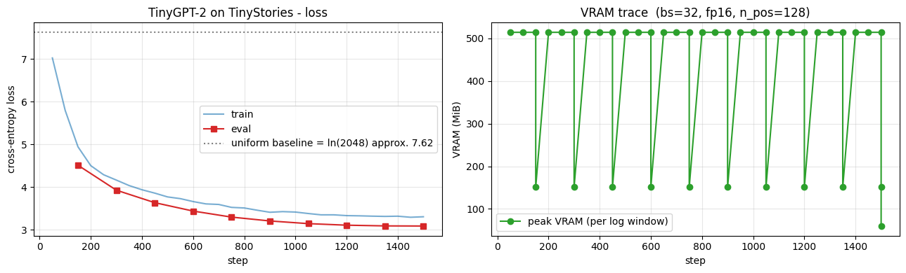

## 환경 준비

```python
%pip install -q -U transformers tokenizers datasets accelerate
```

```python
import warnings
warnings.filterwarnings("ignore")

import math
import os
import random
import time

import numpy as np
import pandas as pd
import matplotlib.pyplot as plt
import torch

# device 자동 감지 - Colab T4 / 로컬 MPS / CPU 모두 지원
if torch.cuda.is_available():
    device = torch.device("cuda")
    device_name = torch.cuda.get_device_name(0)
    vram_gib = torch.cuda.get_device_properties(0).total_memory / 1024**3
    print(f"device     : cuda  ({device_name})")
    print(f"VRAM total : {vram_gib:.2f} GiB")
elif torch.backends.mps.is_available():
    device = torch.device("mps")
    print("device     : mps  (Apple Silicon)")
else:
    device = torch.device("cpu")
    print("device     : cpu  (training will be very slow - Colab T4 recommended)")

print(f"torch      : {torch.__version__}")

# 재현성
SEED = 0
torch.manual_seed(SEED)
np.random.seed(SEED)
random.seed(SEED)

# fp16 은 CUDA 에서만 (MPS 는 미지원, CPU 는 의미 없음)
USE_FP16 = (device.type == "cuda")
print(f"use fp16   : {USE_FP16}")
```

**▶ 실행 결과**

```text
device     : cuda  (Tesla T4)
VRAM total : 14.56 GiB
torch      : 2.11.0+cu128
use fp16   : True
```

```python
from datasets import load_dataset

N_TRAIN = 30_000      # 더 길게 돌리려면 키우세요 (full 은 약 2.1M stories)
N_VAL   = 500

raw_train = load_dataset("roneneldan/TinyStories", split=f"train[:{N_TRAIN}]")
raw_val   = load_dataset("roneneldan/TinyStories", split=f"validation[:{N_VAL}]")
print("train:", raw_train)
print("val  :", raw_val)
print("\n=== sample story ===")
print(raw_train[0]["text"][:400])
```

**▶ 실행 결과**

```text
train: Dataset({
    features: ['text'],
    num_rows: 30000
})
val  : Dataset({
    features: ['text'],
    num_rows: 500
})

=== sample story ===
One day, a little girl named Lily found a needle in her room. She knew it was difficult to play with it because it was sharp. Lily wanted to …(뒤 71자 생략)

Lily went to her mom and said, "Mom, I found this needle. Can you share it with me and sew my shirt?" Her mom smiled and said, "Yes, Lily, w …(뒤 43자 생략)

To
```

**결과 해석**

train 30,000 / val 500 편이 정상 로드되었고, 샘플 스토리가 *4세 어린이가 이해할 단어* 로 된 짧고 단순한 영어 동화임을 확인할 수 있습니다. 이 단순한 어휘·문법 덕분에 약 3M 짜리 작은 모델로도 grammatical 한 생성이 가능합니다.

```python
from tokenizers import Tokenizer
from tokenizers.models import BPE
from tokenizers.trainers import BpeTrainer
from tokenizers.pre_tokenizers import ByteLevel
from tokenizers.decoders import ByteLevel as ByteLevelDecoder
from transformers import PreTrainedTokenizerFast

VOCAB_SIZE = 2048
EOS = "<|endoftext|>"

bpe = Tokenizer(BPE(unk_token=None))
bpe.pre_tokenizer = ByteLevel(add_prefix_space=False)
bpe.decoder = ByteLevelDecoder()
trainer = BpeTrainer(
    vocab_size=VOCAB_SIZE,
    special_tokens=[EOS],
    initial_alphabet=ByteLevel.alphabet(),
    show_progress=True,
)

t0 = time.time()
bpe.train_from_iterator((ex["text"] for ex in raw_train), trainer, length=len(raw_train))
print(f"BPE training done: {time.time()-t0:.1f}s, vocab={bpe.get_vocab_size()}")

# HF 표준 인터페이스로 wrap - bos = eos = pad 모두 <|endoftext|> 로 (GPT-2 컨벤션)
tokenizer = PreTrainedTokenizerFast(
    tokenizer_object=bpe,
    bos_token=EOS,
    eos_token=EOS,
    pad_token=EOS,
)

print("\n=== encode/decode demo ===")
sample = "Once upon a time, a little rabbit went to the forest."
enc = tokenizer(sample)
print(f"input      : {sample}")
print(f"ids        : {enc['input_ids']}")
print(f"tokens     : {tokenizer.convert_ids_to_tokens(enc['input_ids'])}")
print(f"decode     : {tokenizer.decode(enc['input_ids'])}")
print(f"vocab_size : {tokenizer.vocab_size}")
print(f"eos_token  : {tokenizer.eos_token}  id={tokenizer.eos_token_id}")
```

**▶ 실행 결과**

```text
BPE training done: 10.2s, vocab=2048

=== encode/decode demo ===
input      : Once upon a time, a little rabbit went to the forest.
ids        : [428, 440, 259, 394, 12, 259, 395, 1114, 464, 266, 263, 1081, 14]
tokens     : ['Once', 'Ġupon', 'Ġa', 'Ġtime', ',', 'Ġa', 'Ġlittle', 'Ġrabbit', 'Ġwent', 'Ġto', 'Ġthe', 'Ġforest', '.']
decode     : Once upon a time, a little rabbit went to the forest.
vocab_size : 2048
eos_token  : <|endoftext|>  id=0
```

**결과 해석**

`Once upon a time` 처럼 TinyStories 에 자주 등장하는 표현은 `Once`, `Ġupon`, `Ġtime` 처럼 *단어 통째* 의 적은 토큰으로 압축되고, encode → decode 가 원문을 정확히 복원합니다 (`Ġ` 는 byte-level BPE 가 앞 공백을 표시하는 기호). 특수 토큰을 `<|endoftext|>` 하나로 최소화하는 GPT-2 컨벤션도 그대로 확인됩니다.

```python
BLOCK_SIZE = 128

def tokenize_fn(batch):
    return tokenizer(batch["text"])

# 토큰화 (text 컬럼 제거)
tok_train = raw_train.map(tokenize_fn, batched=True, remove_columns=["text"], desc="tokenize train")
tok_val   = raw_val.map(tokenize_fn,   batched=True, remove_columns=["text"], desc="tokenize val")

# 각 story 끝에 EOS 부착 (story 경계 표시)
def add_eos(batch):
    new_ids, new_mask = [], []
    for ids in batch["input_ids"]:
        ids = ids + [tokenizer.eos_token_id]
        new_ids.append(ids)
        new_mask.append([1] * len(ids))
    return {"input_ids": new_ids, "attention_mask": new_mask}

tok_train = tok_train.map(add_eos, batched=True, desc="add eos train")
tok_val   = tok_val.map(add_eos,   batched=True, desc="add eos val")

# group_texts - 모든 토큰을 이어붙여 BLOCK_SIZE 단위로 자름
def group_texts(batch):
    concatenated = {k: sum(batch[k], []) for k in batch.keys()}
    total_len = len(concatenated["input_ids"])
    total_len = (total_len // BLOCK_SIZE) * BLOCK_SIZE
    return {
        k: [t[i : i + BLOCK_SIZE] for i in range(0, total_len, BLOCK_SIZE)]
        for k, t in concatenated.items()
    }

lm_train = tok_train.map(group_texts, batched=True, desc="group train")
lm_val   = tok_val.map(group_texts,   batched=True, desc="group val")

print(f"\ntrain chunks: {len(lm_train):,}  (block_size={BLOCK_SIZE})")
print(f"val   chunks: {len(lm_val):,}")
print(f"approx. train tokens: {len(lm_train) * BLOCK_SIZE / 1e6:.2f} M")
print("\nfirst chunk decode (first 200 chars):")
print(tokenizer.decode(lm_train[0]["input_ids"])[:200])
```

**▶ 실행 결과**

```text
train chunks: 57,973  (block_size=128)
val   chunks: 867
approx. train tokens: 7.42 M

first chunk decode (first 200 chars):
One day, a little girl named Lily found a needle in her room. She knew it was difficult to play with it because it was sharp. Lily wanted to …(뒤 60자 생략)
```

**결과 해석**

가변 길이 30,000 편이 모든 토큰을 이어붙인 뒤 `block_size=128` 단위로 잘려 약 57,973 개 chunk (약 7.42M 토큰) 가 되었습니다. 첫 chunk 가 정상적인 동화 문장으로 디코드되어 `group_texts` 전처리가 의도대로 동작했음을 보여줍니다.

```python
from transformers import DataCollatorForLanguageModeling

collator_demo = DataCollatorForLanguageModeling(tokenizer=tokenizer, mlm=False)
demo_batch = collator_demo([lm_train[0], lm_train[1]])

input_ids = demo_batch["input_ids"]
labels = demo_batch["labels"]

print(f"input_ids shape: {tuple(input_ids.shape)}")
print(f"labels shape   : {tuple(labels.shape)}")

# -100 자리 vs 학습 신호 자리 비율
total = labels.numel()
n_ignored = (labels == -100).sum().item()
n_train_signal = total - n_ignored
print(f"\n=== 'labels = -100' thread - CausalLM vs MLM comparison ===")
print(f"total positions      : {total}")
print(f"  ignored (-100)     : {n_ignored:>5d}  ({100 * n_ignored / total:5.2f}%)")
print(f"  train signal       : {n_train_signal:>5d}  ({100 * n_train_signal / total:5.2f}%)")
print(f"\n[MLM (Ch 20/22)]     approx. 85% = -100, 15% = train signal")
print(f"[CausalLM (this ch)] {100 * n_ignored / total:5.2f}% = -100, {100 * n_train_signal / total:5.2f}% = train signal  <- almost every position")
print(f"\n=> a single step's token-learning efficiency: GPT pretrain is approx. 5-6x higher than MLM")

# input_ids 와 labels 의 동일성 검증 (pad 가 아닌 자리)
identical = (input_ids == labels).sum().item()
print(f"\n(input_ids == labels) positions: {identical}/{total}  - clone as-is")
```

**▶ 실행 결과**

```text
input_ids shape: (2, 128)
labels shape   : (2, 128)

=== 'labels = -100' thread - CausalLM vs MLM comparison ===
total positions      : 256
  ignored (-100)     :     1  ( 0.39%)
  train signal       :   255  (99.61%)

[MLM (Ch 20/22)]     approx. 85% = -100, 15% = train signal
[CausalLM (this ch)]  0.39% = -100, 99.61% = train signal  <- almost every position

=> a single step's token-learning efficiency: GPT pretrain is approx. 5-6x higher than MLM

(input_ids == labels) positions: 255/256  - clone as-is
```

**결과 해석**

`mlm=False` collator 가 `labels = input_ids.clone()` 을 만들어 256 자리 중 단 1 개 (0.39%) 만 `-100` 이고 99.61% 가 학습 신호입니다 — MLM 이 약 85% 를 `-100` 으로 가렸던 것과 정반대로, 같은 `-100` 트릭이 *적용 자리만 뒤집힌* 셈입니다. 한 step 당 학습되는 토큰 수가 MLM 대비 약 5-6배 많아 GPT 사전학습이 그만큼 토큰 효율이 높습니다.

```python
from transformers import GPT2Config, GPT2LMHeadModel

config = GPT2Config(
    vocab_size=tokenizer.vocab_size,
    n_positions=BLOCK_SIZE,
    n_embd=256,
    n_layer=4,
    n_head=4,
    bos_token_id=tokenizer.bos_token_id,
    eos_token_id=tokenizer.eos_token_id,
    pad_token_id=tokenizer.pad_token_id,
    activation_function="gelu_new",
    resid_pdrop=0.1, embd_pdrop=0.1, attn_pdrop=0.1,
)

model = GPT2LMHeadModel(config).to(device)   # 학습 전 generation 시연용으로 미리 GPU 로
n_params = model.num_parameters()
print(f"#params           : {n_params/1e6:.2f} M")
print(f"weight tying      : {config.tie_word_embeddings}  (lm_head <-> wte shared)")
print(f"fp32 weight size  : {n_params * 4 / 1024**2:.2f} MiB")
print(f"\nmodel: {type(model).__name__}")
print(f"  - body : {type(model.transformer).__name__}  (Decoder, causal attention)")
print(f"  - head : {type(model.lm_head).__name__}(in={model.lm_head.in_features}, out={model.lm_head.out_features})")
```

**▶ 실행 결과**

```text
#params           : 3.72 M
weight tying      : True  (lm_head <-> wte shared)
fp32 weight size  : 14.18 MiB

model: GPT2LMHeadModel
  - body : GPT2Model  (Decoder, causal attention)
  - head : Linear(in=256, out=2048)
```

**결과 해석**

약 3.72M params 의 작은 GPT 가 `from_pretrained` 없이 random init 으로 생성되었고, 본체는 causal attention 을 내장한 `GPT2Model` (Decoder), head 는 `Linear(256, 2048)` LM head 입니다. `tie_word_embeddings=True` 로 LM head 와 input embedding 이 같은 weight 를 공유해 파라미터를 절약합니다.

```python
PROMPTS = [
    "Once upon a time,",
    "The little girl",
    "A big dog",
]
GEN_KWARGS = dict(max_new_tokens=60, do_sample=True, temperature=0.8, top_k=50)


@torch.no_grad()
def generate_text(active_model, prompt: str, gen_tokenizer=None, **kwargs):
    tok = gen_tokenizer if gen_tokenizer is not None else tokenizer
    enc = tok(prompt, return_tensors="pt").to(active_model.device)
    out = active_model.generate(
        **enc,
        pad_token_id=tok.pad_token_id,
        eos_token_id=tok.eos_token_id,
        **kwargs,
    )
    return tok.decode(out[0], skip_special_tokens=True)


# 재현성을 위해 학습 전·후 동일 seed
torch.manual_seed(SEED)
model.eval()
before_outputs = []
print("=" * 70)
print("UNTRAINED model - generation from random initial weights")
print("=" * 70)
for p in PROMPTS:
    text = generate_text(model, p, **GEN_KWARGS)
    before_outputs.append(text)
    print(f"\n[prompt] {p}")
    print(text)
```

**▶ 실행 결과**

```text
======================================================================
UNTRAINED model - generation from random initial weights
======================================================================
[prompt] Once upon a time,
Once upon a time,ushinkush min is wondered5 cruallyked bed farmer smo wonder smo dropped crush child�� grabbed home5ail wonder� bed j( slow …(뒤 96자 생략)
[prompt] The little girl
The little girlakak everyush Sarahgged:un't different different# gl keepner Graied likedJackampsel turnedDo decided beautiful} Gra has Benny …(뒤 120자 생략)
[prompt] A big dog
A big dog cle music hisftere learnedpe fam pullve bat batinin paper paper teacherkes cr wear soup yes curi tw7 colors wall runlf This Sam bb …(뒤 113자 생략)
```

**결과 해석**

random init 모델은 logits 가 무작위 초기값이라 *의미 없는 byte 조각·짧은 단어가 반복* 되는, 영어 문장과 거리가 먼 출력을 냅니다. 이 출력이 학습 후 결과와 나란히 비교할 *기준선* 으로, 사전학습이 본체에 next-token 분포를 새기기 전 상태를 보여줍니다.

```python
from transformers import (DataCollatorForLanguageModeling, Trainer,
                          TrainingArguments, TrainerCallback)

collator = DataCollatorForLanguageModeling(tokenizer=tokenizer, mlm=False)

args = TrainingArguments(
    output_dir="./out_gpt_tinystories",
    max_steps=1500,
    per_device_train_batch_size=32,
    per_device_eval_batch_size=32,
    learning_rate=3e-4,
    weight_decay=0.1,
    adam_beta1=0.9, adam_beta2=0.95,
    warmup_steps=100,
    lr_scheduler_type="cosine",
    max_grad_norm=1.0,
    fp16=USE_FP16,                       # T4 는 bf16 불가
    logging_steps=50,
    eval_strategy="steps",
    eval_steps=150,
    save_strategy="no",
    report_to="none",
    dataloader_num_workers=2,
    dataloader_pin_memory=True,
    seed=SEED,
)


class VRAMCallback(TrainerCallback):
    '''step 별 peak VRAM 기록 (로깅 윈도우 단위로 reset). CUDA 에서만 유효.'''

    def __init__(self):
        self.steps, self.peak_MiB = [], []

    def on_train_begin(self, args, state, control, **kwargs):
        if torch.cuda.is_available():
            torch.cuda.reset_peak_memory_stats()

    def on_log(self, args, state, control, logs=None, **kwargs):
        if torch.cuda.is_available():
            peak = torch.cuda.max_memory_allocated() / 1024**2
            self.steps.append(state.global_step)
            self.peak_MiB.append(peak)
            torch.cuda.reset_peak_memory_stats()


vram_cb = VRAMCallback()

trainer = Trainer(
    model=model,
    args=args,
    train_dataset=lm_train,
    eval_dataset=lm_val,
    data_collator=collator,
    callbacks=[vram_cb],
)

t0 = time.time()
train_out = trainer.train()
elapsed = time.time() - t0

print(f"\n=== training summary ===")
print(f"elapsed       : {elapsed/60:.2f} min")
print(f"global_step   : {train_out.global_step}")
print(f"train_loss    : {train_out.training_loss:.4f}")
print(f"random baseline (ln vocab): {math.log(tokenizer.vocab_size):.4f}")
if torch.cuda.is_available():
    print(f"final peak    : {torch.cuda.max_memory_allocated()/1024**2:.0f} MiB")
```

**▶ 실행 결과**

```text
[transformers] `loss_type=None` was set in the config but it is unrecognized. Using the default loss: `ForCausalLMLoss`.
<IPython.core.display.HTML object>
=== training summary ===
elapsed       : 0.88 min
global_step   : 1500
train_loss    : 3.8319
random baseline (ln vocab): 7.6246
final peak    : 60 MiB
```

**결과 해석**

최종 `train_loss` 약 3.83 으로 random baseline `ln(2048) ≈ 7.62` 대비 크게 떨어져, 모델이 다음 토큰 후보를 *균등 추측에서 수십 개 수준으로 좁힌* 상태입니다. peak VRAM 약 60 MiB 로 T4 16GB 에 한참 여유가 있어 작은 모델·짧은 context 의 가벼움을 보여줍니다.

```python
# loss curve + VRAM trace
log = trainer.state.log_history
train_pts = [(r["step"], r["loss"]) for r in log if "loss" in r and "eval_loss" not in r]
eval_pts  = [(r["step"], r["eval_loss"]) for r in log if "eval_loss" in r]

fig, (ax1, ax2) = plt.subplots(1, 2, figsize=(13, 4))

# loss
ax1.plot([s for s, _ in train_pts], [l for _, l in train_pts], "-",
         color="tab:blue", alpha=0.6, label="train")
if eval_pts:
    ax1.plot([s for s, _ in eval_pts], [l for _, l in eval_pts], "s-",
             color="tab:red", label="eval")
ax1.axhline(math.log(tokenizer.vocab_size), ls=":", color="gray",
            label=f"uniform baseline = ln({tokenizer.vocab_size}) approx. {math.log(tokenizer.vocab_size):.2f}")
ax1.set_xlabel("step"); ax1.set_ylabel("cross-entropy loss")
ax1.set_title("TinyGPT-2 on TinyStories - loss")
ax1.grid(True, alpha=0.3); ax1.legend()

# VRAM (CUDA 만)
if vram_cb.steps:
    ax2.plot(vram_cb.steps, vram_cb.peak_MiB, "o-", color="tab:green",
             label="peak VRAM (per log window)")
    ax2.set_title(f"VRAM trace  (bs=32, fp16, n_pos={BLOCK_SIZE})")
else:
    ax2.text(0.5, 0.5, "VRAM trace available on CUDA only",
             ha="center", va="center", transform=ax2.transAxes)
    ax2.set_title("VRAM trace - CUDA only")
ax2.set_xlabel("step"); ax2.set_ylabel("VRAM (MiB)")
ax2.grid(True, alpha=0.3); ax2.legend()

plt.tight_layout(); plt.show()
```

**▶ 실행 결과**



**결과 해석**

train·eval loss 가 점선으로 표시된 균등 baseline `ln(2048) ≈ 7.62` 아래로 빠르게 내려가 안정화되고, 오른쪽 VRAM 추이는 학습 내내 수십 MiB 수준으로 평탄합니다. eval loss 가 train loss 를 크게 벗어나지 않아 과적합 없이 학습이 진행됨을 보여줍니다.

```python
torch.manual_seed(SEED)
model.eval()
after_outputs = []
print("=" * 70)
print("TRAINED model - generation after Trainer.train()")
print("=" * 70)
for p in PROMPTS:
    text = generate_text(model, p, **GEN_KWARGS)
    after_outputs.append(text)
    print(f"\n[prompt] {p}")
    print(text)
```

**▶ 실행 결과**

```text
======================================================================
TRAINED model - generation after Trainer.train()
======================================================================
[prompt] Once upon a time,
Once upon a time, there was a girl named Lily. She loved to play with her friends. She loved to play outside to play with her friends when t …(뒤 32자 생략)

One day, Lily saw a small house, a boy named Timmy. He was so happy because he saw a big
[prompt] The little girl
The little girl had been a wonderful time. It was so happy to see the park. She thanked the garden, and the girl. She thanked the little gir …(뒤 129자 생략)
[prompt] A big dog
A big dog, but they could go in the park. They ran away and the truck. The bird was sad. It had a bit fun.

"But we can't get my mouth. I can play with you."

"It's okay, it is not very curious. He is not
```

**결과 해석**

학습 후에는 `there was a girl named Lily` 처럼 *주어 + 동사 + 목적어* 구조의 말이 되는 영어 문장과 동화 풍 어휘 (Lily, friends, park, ...) 가 나옵니다. 완벽하진 않아도 사전학습이 본체에 next-token 분포를 새겼음을 generation 으로 직접 확인할 수 있습니다.

```python
# before / after 나란히 - 사전학습이 본체에 새긴 next-token 분포의 직접적 증거
print("=" * 78)
print("BEFORE (random init) vs AFTER (trained on TinyStories 30K)")
print("=" * 78)
for p, before, after in zip(PROMPTS, before_outputs, after_outputs):
    print(f"\nPROMPT  : {p}")
    print("-" * 78)
    print(f"BEFORE  : {before[len(p):].strip()[:280]}")
    print(f"AFTER   : {after[len(p):].strip()[:280]}")
```

**▶ 실행 결과**

```text
==============================================================================
BEFORE (random init) vs AFTER (trained on TinyStories 30K)
==============================================================================

PROMPT  : Once upon a time,
------------------------------------------------------------------------------
BEFORE  : ushinkush min is wondered5 cruallyked bed farmer smo wonder smo dropped crush child�� grabbed home5ail wonder� bed j( slowy clapp …(뒤 89자 생략)
AFTER   : there was a girl named Lily. She loved to play with her friends. She loved to play outside to play with her friends when they put …(뒤 24자 생략)

One day, Lily saw a small house, a boy named Timmy. He was so happy because he saw a big

PROMPT  : The little girl
------------------------------------------------------------------------------
BEFORE  : akak everyush Sarahgged:un't different different# gl keepner Graied likedJackampsel turnedDo decided beautiful} Gra has Benny find …(뒤 115자 생략)
AFTER   : had been a wonderful time. It was so happy to see the park. She thanked the garden, and the girl. She thanked the little girl to k …(뒤 123자 생략)

PROMPT  : A big dog
------------------------------------------------------------------------------
BEFORE  : cle music hisftere learnedpe fam pullve bat batinin paper paper teacherkes cr wear soup yes curi tw7 colors wall runlf This Sam bb …(뒤 113자 생략)
AFTER   : , but they could go in the park. They ran away and the truck. The bird was sad. It had a bit fun.

"But we can't get my mouth. I can play with you."

"It's okay, it is not very curious. He is not
```

**결과 해석**

같은 prompt·seed 에서 BEFORE 의 무의미한 byte 조각 나열이 AFTER 에서는 동화 풍 영어 문장으로 바뀌어, 1500 step 의 사전학습이 만든 차이가 세 prompt 모두에서 한눈에 드러납니다. Ch 20·22 의 *사전·사후 [MASK] top-5* 비교의 generation 판에 해당합니다.

```python
from transformers import AutoTokenizer, AutoModelForCausalLM

print("loading reference gpt2 (124M, OpenAI WebText pretraining)...")
ref_tok = AutoTokenizer.from_pretrained("gpt2")
ref_tok.pad_token = ref_tok.eos_token
ref_model = AutoModelForCausalLM.from_pretrained("gpt2").to(device).eval()
print(f"  vocab_size : {ref_tok.vocab_size:,}")
print(f"  #params    : {ref_model.num_parameters()/1e6:.1f} M")

torch.manual_seed(SEED)
ref_outputs = []
print("\n" + "=" * 70)
print("REFERENCE gpt2 (124M, WebText) - generation on same prompts")
print("=" * 70)
for p in PROMPTS:
    text = generate_text(ref_model, p, gen_tokenizer=ref_tok, **GEN_KWARGS)
    ref_outputs.append(text)
    print(f"\n[prompt] {p}")
    print(text)

# 메모리 정리
del ref_model
if torch.cuda.is_available():
    torch.cuda.empty_cache()
```

**▶ 실행 결과**

```text
loading reference gpt2 (124M, OpenAI WebText pretraining)...
  vocab_size : 50,257
  #params    : 124.4 M

======================================================================
REFERENCE gpt2 (124M, WebText) - generation on same prompts
======================================================================
[prompt] Once upon a time,
Once upon a time, if you don't know what your country's government is doing, you can find out.

In the last few months, I've traveled to dozens of countries around the world, and I've seen the results of that.

My new book — the Making of a Better World Order:
[prompt] The little girl
The little girl has been at her desk all day...for two hours. She's got a pen and paper and a pen and paper, not a pen and paper and pencil. …(뒤 112자 생략)
[prompt] A big dog
A big dog is a dog that loves to eat, but is also a dog that's afraid to do anything that might hurt others.

In the long run, we find that people who have an allergy to animals are less likely to have allergies to dogs.

But these people are less likely to have
```

**결과 해석**

124M params·WebText 약 40GB 로 사전학습된 `gpt2` 는 같은 prompt 에 *동화풍이 아닌 일반 산문·뉴스·대화* 톤의 다양하고 자연스러운 문장을 냅니다. 학습 데이터 분포의 다양성이 generation 다양성으로 직결됨을 보여줍니다.

```python
# 3-way 비교 - BEFORE (random) / OURS (3M, TinyStories) / REF (gpt2 124M, WebText)
print("=" * 78)
print("3-way comparison: BEFORE (random) / OURS (3M, TinyStories 30K) / REF (gpt2 124M, WebText)")
print("=" * 78)
for p, before, after, ref in zip(PROMPTS, before_outputs, after_outputs, ref_outputs):
    print(f"\nPROMPT : {p}")
    print("-" * 78)
    print(f"BEFORE : {before[len(p):].strip()[:240]}")
    print(f"OURS   : {after[len(p):].strip()[:240]}")
    print(f"REF    : {ref[len(p):].strip()[:240]}")
```

**▶ 실행 결과**

```text
==============================================================================
3-way comparison: BEFORE (random) / OURS (3M, TinyStories 30K) / REF (gpt2 124M, WebText)
==============================================================================

PROMPT : Once upon a time,
------------------------------------------------------------------------------
BEFORE : ushinkush min is wondered5 cruallyked bed farmer smo wonder smo dropped crush child�� grabbed home5ail wonder� bed j( slowy clappe …(뒤 88자 생략)
OURS   : there was a girl named Lily. She loved to play with her friends. She loved to play outside to play with her friends when they put o …(뒤 23자 생략)

One day, Lily saw a small house, a boy named Timmy. He was so happy because he saw a
REF    : if you don't know what your country's government is doing, you can find out.

In the last few months, I've traveled to dozens of countries around the world, and I've seen the results of that.

My new book — the Making of a Better World Orde

PROMPT : The little girl
------------------------------------------------------------------------------
BEFORE : akak everyush Sarahgged:un't different different# gl keepner Graied likedJackampsel turnedDo decided beautiful} Gra has Benny find …(뒤 109자 생략)
OURS   : had been a wonderful time. It was so happy to see the park. She thanked the garden, and the girl. She thanked the little girl to ke …(뒤 109자 생략)
REF    : has been at her desk all day...for two hours. She's got a pen and paper and a pen and paper, not a pen and paper and pencil. And sh …(뒤 105자 생략)

PROMPT : A big dog
------------------------------------------------------------------------------
BEFORE : cle music hisftere learnedpe fam pullve bat batinin paper paper teacherkes cr wear soup yes curi tw7 colors wall runlf This Sam bby …(뒤 109자 생략)
OURS   : , but they could go in the park. They ran away and the truck. The bird was sad. It had a bit fun.

"But we can't get my mouth. I can play with you."

"It's okay, it is not
...
```

**결과 해석**

BEFORE (random) → OURS (3M, TinyStories 30K) → REF (gpt2 124M, WebText) 로 갈수록 출력이 *무의미 → 동화 풍 단순 영어 → 다양한 도메인의 자연스러운 산문* 으로 좋아집니다. 이 격차가 정확히 *모델 크기 + 데이터 규모 + 데이터 다양성* 의 격차이며, Ch 25 가 데이터 축을 통제해 이 차이를 좁히는 챕터입니다.
